# Software Development Wastes Analysis 🚮
# 1. Introduction
This report presents design and summarizes results of the survey research "***What kind of wastes are the most common and most harmful in software development projects?***". The survey research was a part of the project realized in the frame of Quality Management and Experimental Software Engineering classes at Poznan University of Technology.

# 2. Objectives
## Research questions
* **RQ1**: What kinds of wastes in software development are the most common?
* **RQ2**: What kinds of wastes in software development are the most harmful?
* **RQ3**: Is there a relationship between frequency / harm of a "waste" and work experience?

## Hypothesis
* **H1**: Opinions on frequency and harm of a "waste" are related to kind (programming language and role) of work experience
* **H2**: Opinions on frequency and harm of a "waste" are related to amount (length and level) of work experience

## Scope
The scope of our survey was to ask (as many as possible) people working in software projects, either professionally or in university projects.

# 3. Design
We designed our study as a cross-sectional as we think that this approach fits our research questions the best. A big advantage of a cross-sectional study is that it’s fairly easy and quick to both conduct and gather the results. We decided to administer the survey to the participants in the way of self-administered, online questionnaires.

# 4. Instrument
Our idea for the instrument was to create a survey on Google Forms as it’s the most convenient and popular approach nowadays. [Link](https://docs.google.com/forms/d/1OqUA8RYgZe0b8pPqrQZ_e4ml1H4hFOJ3NlbcotC5wDY/edit?usp=sharing) to the survey on Google Forms:

## Questions
**Q1: What is your name?**  
Justification: This question allows us to identify who already filled our survey  
Type of response: Open

**Q2: What is the main programming language you use in the chosen project?**  
Justification: This question supports RQ3  
Type of response: Open

**Q3: What is your main role in the chosen project?**  
Justification: This question supports RQ3  
Type of response: Single choice from the list of most popular roles in projects  
Roles: Frontend Developer, Backend Developer, Fullstack Developer, PM, DevOps  
There is also an option to add your own role

**Q4: What is your level of work experience in a such or similar role?**  
Justification: This question supports RQ3  
Type of response: 5-steps scale from Junior to Senior

**Q5: How long (in months) is your work experience in a such or similar role in general?**  
Justification: This question supports RQ3  
Type of response: Open

**Q6: How long (in months) is your work experience in the chosen project?**  
Justification: This question supports RQ3  
Type of response: Open

**Q7: How common are those task-related "wastes" in the chosen project?**  
Justification: This question supports RQ1 and RQ3  
Type of response: Matrix of (single-per-row) choices where each row is a kind of "waste" and each column is a degree of how common is that "waste"  
Columns: 5-steps scale from "Doesn’t happen" to "Very common"  
Rows: List of some task-related "wastes" that might be found in projects "Wastes":
* Unclearly defined tasks
* Focusing on unneeded tasks
* Leaving tasks uncompleted
* Poorly executed tasks
* Avoiding specific tasks

**Q8: How harmful are those task-related "wastes" in the chosen project?**  
Justification: This question supports RQ2 and RQ3  
Type of response: Matrix of (single-per-row) choices where each row is a kind of "waste" and each column is a degree of how harmful is that "waste"  
Columns: 5-steps scale from "Not harmful" to "Very harmful"  
Rows: same as in Q7

**Q9: How common are those information-related "wastes" in the chosen project?**  
Justification: This question supports RQ1 and RQ3  
Type of response: Matrix of (single-per-row) choices where each row is a kind of "waste" and each column is a degree of how common is that "waste"  
Columns: 5-steps scale from "Doesn’t happen" to "Very common"  
Rows: List of some information-related "wastes" that might be found in projects "Wastes":
* Issues with documentation
* Wrong introduction of new team members
* Too frequent meetings
* Too long meetings
* Bad flow of information inside team
* Language communication issues

**Q10: How harmful are those information-related "wastes" in the chosen project?**  
Justification: This question supports RQ2 and RQ3  
Type of response: Matrix of (single-per-row) choices where each row is a kind of "waste" and each column is a degree of how harmful is that "waste"  
Columns: 5-steps scale from "Not harmful" to "Very harmful"  
Rows: same as in Q9

# 5. Executing the study
Data was collected during the period between **18.02.21** and **24.02.21**. Respondents were students from our university group. In total there were 13 respondents.

# 6. Analysis
**Q2: Main programming languages used in chosen projects**  
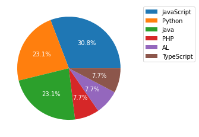

**Q3: Main roles in the chosen projects**  
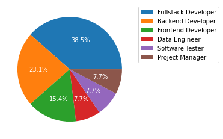

**Q4: Work experience level in a such or similar role**  
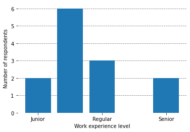

**Q5: Work experience (in months) in a such or similar role**  
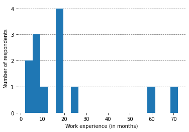

**Q6: Work experience (in months) in the chosen projects**  
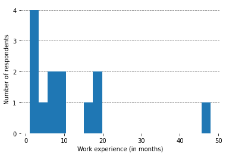

**Q7: Frequency of task-related "wastes" in the chosen projects**  
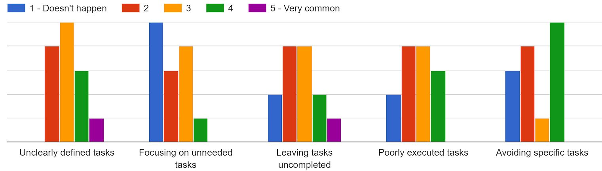

**Q8: Harmfulness of task-related "wastes" in the chosen projects**  
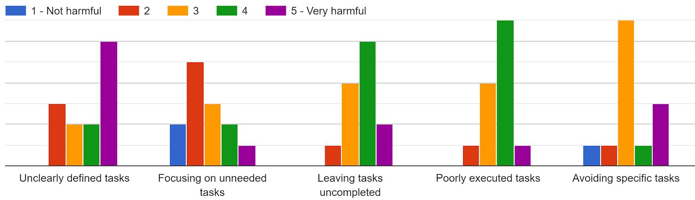

**Q9: Frequency of information-related "wastes" in the chosen projects**  
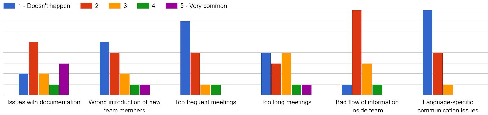

**Q10: Harmfulness of information-related "wastes" in the chosen projects**  
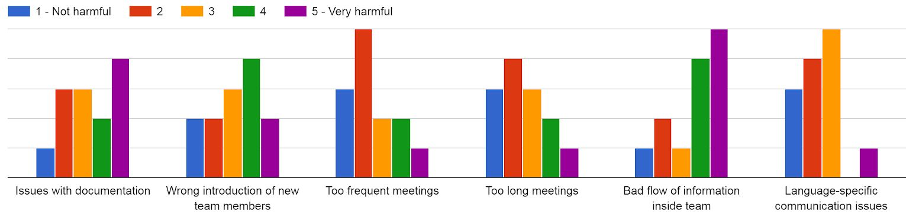

# 7. Threats to validity
* Our university group is specific because a big part of our studies is about participating in projects from an architecture and management perspective (and not development) - maybe people from different Master specializations would answer differently.
* Our university group is specific because most of us work as developers - maybe people working in other roles would answer differently.

# 8. Conclusions
**RQ1: We found out that those kinds of waste are the most common**  
**RQ2: We found out that those kinds of waste are the most harmful**  
**RQ3: We found out that those kinds of "waste" in software development are related to those features**  
## 8.1. Frequency-wise  
### 8.1.1. Programming language  
### 8.1.2. Role  
### 8.1.3. Work experience  
## 8.2. Harmfulness-wise  
### 8.2.1. Programming language  
### 8.2.2. Role  
### 8.2.3. Work experience  
## 8.3. Additional findings  
### 8.3.1. Relationships between frequency and harmfulness of a waste
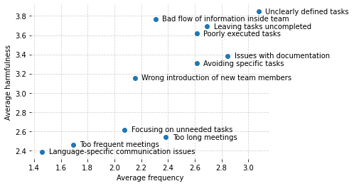 
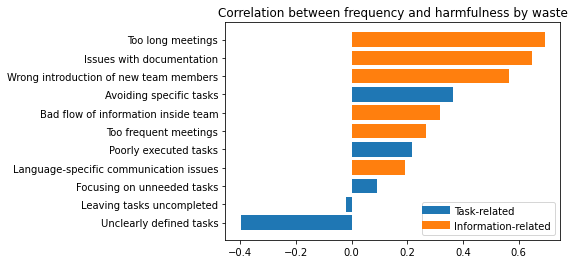  
### 8.3.2. Correlations between wastes
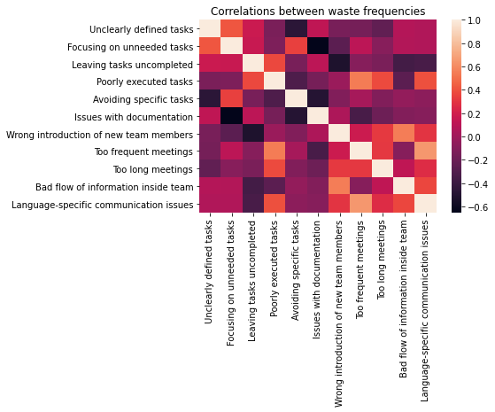  
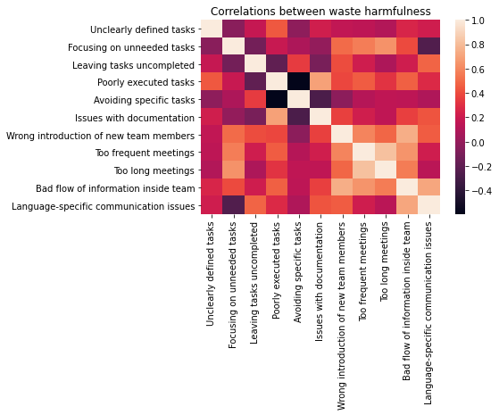  
